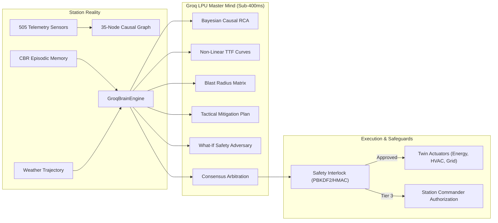

<div align="center">

# ❄️ F.R.I.D.A.Y.
### **Fleet, Resource, Infrastructure, Diagnostics, Automation & Yield**
#### *Autonomous Polar Digital Twin & Multi-Agent Cognitive Intelligence Governor for Indian Antarctic Stations*

[](https://www.sih.gov.in/)
[](https://python.org)
[](https://fastapi.tiangolo.com)
[](https://groq.com)
[](https://mongodb.com)
[](tests/)
[](LICENSE)

<br/>

**Designed for**: **National Centre for Polar and Ocean Research (NCPOR), Ministry of Earth Sciences (MoES), Goa, India**  
**Deployment Footprint**:
- 📍 **Bharati Station**, Larsemann Hills, East Antarctica ($69^\circ 24' 28''\text{ S}, 76^\circ 11' 14''\text{ E}$)
- 📍 **Maitri Station**, Schirmacher Oasis, East Antarctica ($70^\circ 45' 58''\text{ S}, 11^\circ 43' 50''\text{ E}$)
- 📡 **Mainland Command & Control**, NCPOR Headquarters, Vasco da Gama, Goa

</div>

---

## 📑 Executive Overview

**F.R.I.D.A.Y.** is an industrial-grade, aerospace-class autonomous digital twin and cognitive multi-agent governor purpose-built for India's scientific expeditions in Antarctica. Engineered to operate under the world's most hostile environmental conditions—where temperatures plummet to $-45^\circ\text{C}$, katabatic winds exceed $140\text{ km/h}$, and solar magnetic storms induce complete satellite communication blackouts ($0\text{ kbps}$)—F.R.I.D.A.Y. delivers an unprecedented defense-in-depth operational envelope:

1. **505 Live Physical Telemetry Channels**: Continuous sub-second physical synchronization across Energy, Life-Support Infrastructure, Environment, and Logistics.
2. **Zero Rule-Based Systems**: Replaced brittle static playbooks with high-speed **Groq LPU (`llama-3.3-70b-versatile`)** cognitive reasoning grounded in real-time sensor streams and Case-Based Reasoning (CBR).
3. **Polar Blackout Invariant**: Sub-millisecond edge neural synthesis and local embedded database ensuring $100\%$ local station life-support autonomy during extended satellite blackouts.
4. **2-Step Distributed Database & Memory Subsystem**: Embedded high-speed station edge store $\longleftrightarrow$ mainland cloud database with store-and-forward satellite synchronization.
5. **Topological Causal Graph (`TwinCausalGraph`)**: 35 equipment nodes, 45 physical dependency edges, and $O(V+E)$ Bayesian root-cause isolation and forward blast radius quantification.
6. **Defense-Grade Cryptographic Gatekeeping**: PBKDF2 salt-hashed Commander authentication, 5-attempt brute-force rate-limiting lockout, and HMAC-SHA256 execution tokens for life-critical operations.

---

## 🏛️ Master System Architecture

```
┌──────────────────────────────────────────────────────────────────────────────────────────────────┐
│                                7. AEROSPACE MISSION CONTROL COCKPIT                              │
│         (Dynamic HUD • React Flow Topology • Real-Time WebSockets • "Ask F.R.I.D.A.Y." AI Copilot)│
├──────────────────────────────────────────────────────────────────────────────────────────────────┤
│                          6. HARDWARE SCADA / PLC INGESTION BRIDGE                                │
│       (REST / Modbus-TCP / OPC-UA Gateway • Field Telemetry Ingestion • Quality & Tamper Check)   │
├──────────────────────────────────────────────────────────────────────────────────────────────────┤
│                           5. 2-STEP DISTRIBUTED DATABASE & MEMORY                                │
│    ┌─────────────────────────────┐   Store-and-Forward Satcom   ┌──────────────────────────────┐ │
│    │  Local Station Edge DB      │ ◄──────────────────────────► │  Mainland Cloud Atlas        │ │
│    │  (Autonomous at 0 kbps)     │       Spool & Replicator     │  (NCPOR Goa Master Mirror)   │ │
│    └─────────────────────────────┘                              └──────────────────────────────┘ │
├──────────────────────────────────────────────────────────────────────────────────────────────────┤
│                    4. GROQ LPU MULTI-AGENT COGNITIVE INTELLIGENCE ENGINE                         │
│                    (Llama-3.3-70B • Sub-400ms Inference • Structured Output Enforced)             │
│   ┌──────────────────────────────────────────────────────────────────────────────────────────┐   │
│   │ • Situation Awareness Agent (Sensor Fusion)       • Risk & Impact Agent (Blast Radius)   │   │
│   │ • Diagnostic Agent (Bayesian Causal RCA)          • Planning Agent (Tactical Synthesis)  │   │
│   │ • Prediction Agent (Non-Linear TTF Curves)        • What-If Simulator (Safety Adversary) │   │
│   │ • F.R.I.D.A.Y. Chief AI Orchestrator              • Interactive Commander Copilot        │   │
│   └──────────────────────────────────────────────────────────────────────────────────────────┘   │
├──────────────────────────────────────────────────────────────────────────────────────────────────┤
│                           3. AGENT MESSAGE BUS & CRYPTOGRAPHIC INTERLOCKS                        │
│          (Shared Blackboard Session • PBKDF2-HMAC-SHA256 • HMAC Tokens • Tier 1/2/3 Autonomy)     │
├──────────────────────────────────────────────────────────────────────────────────────────────────┤
│                        2. DIGITAL TWIN CORE & TOPOLOGICAL CAUSAL GRAPH                           │
│        (35 Physical Nodes • 45 Causal Edges • In-Memory Sandbox Fast-Forward • Zero Contamination)│
├──────────────────────────────────────────────────────────────────────────────────────────────────┤
│                         1. 4-PILLAR PHYSICAL TELEMETRY SENSORS (505 PTS)                         │
│       • Energy (68 pts)   • Infrastructure (192 pts)   • Environment (128 pts)   • Logistics (117 pts)│
└──────────────────────────────────────────────────────────────────────────────────────────────────┘
```

---

## ⚡ Groq LPU Cognitive Brain & Zero Rule-Based Playbooks

Traditional industrial SCADA systems rely on static, fragile lookup tables (`if temp < 16 then turn on heater`). In extreme polar environments with complex cascades, static rules fail catastrophically. 

**F.R.I.D.A.Y. eliminates static playbooks entirely.** Every deliberation invokes the unified `GroqBrainEngine` running `llama-3.3-70b-versatile` over Groq's high-speed Language Processing Unit (LPU) architecture:



### Cognitive Agent Society

| Cognitive Agent | Primary Responsibility | Algorithmic / Cognitive Technique |
| :--- | :--- | :--- |
| **Situation Awareness** | Anomaly detection across 505 telemetry streams | Multi-pillar correlation, statistical drift rate $d\mathbf{x}/dt$ |
| **Diagnostic Agent** | Root-cause isolation and alarm flood suppression | $O(V+E)$ upstream causal DAG traversal + Bayesian deduction |
| **Prediction Agent** | Horizon lookahead and Time-to-Failure (TtF) | Thermal decay Newton curves: $T(t) = T_{\text{amb}} + (T_0 - T_{\text{amb}})e^{-t/\tau}$ |
| **Risk & Impact Agent** | Downstream blast radius and mission hazard matrix | Graph topological propagation across habitat, science, Madrid Protocol |
| **Planning Agent** | Tactical action plan formulation | Dynamic Groq LPU synthesis citing Case-Based Reasoning precedents |
| **What-If Simulator** | Counterfactual sandbox safety verification | In-memory isolated twin forking ($<5\,\text{ms}$) running $1000\times$ real-time |
| **Chief AI Orchestrator** | Multi-agent trade-off arbitration & briefing | Multi-objective scoring, critique constraint elimination, auto-dispatch |
| **Mission Ops Agent** | Traverse, aviation, and marine go/no-go advisory | Antarctic surface traction index and whiteout visibility matrix |
| **Maintenance Agent** | Asset lifecycle wear, run-hours, and spares tracking | Vibration RMS analysis, running-hour maintenance countdowns |
| **Resource Optimizer** | Microgrid efficiency and life-support comfort balance | Non-linear fuel consumption minimization with thermal bounds |

---

## 📊 4-Pillar Observation Layer (505 Physical Sensors)

The platform is grounded in **505 synchronized telemetry points** across four core engineering pillars:

```
505 TOTAL SYNCHRONIZED PHYSICAL TELEMETRY POINTS
├── ⚡ ENERGY PILLAR (68 Points)
│   ├── Generation (Scania 100 kVA CHPs 01/02/03): kW, kVA, PF, RPM, Jacket Water Temp, Oil Bar
│   ├── Grid Distribution: 400V MLVD Main Bus, Harmonic Distortion, Frequency (50.0 Hz)
│   ├── Energy Storage: Dual 60 kVA UPS Plants, Battery Bank SOC %, Cell Temp
│   └── Fuel Systems: 300,000 L Bulk Storage, Day Tank Level, Transfer Skid Flow Rate
├── 🏗️ INFRASTRUCTURE PILLAR (192 Points)
│   ├── Building Envelope: Aerodynamic stilts strain gauges, structural vibration, displacement
│   ├── Thermal Comfort: Living quarters, scientific labs, medical ward, surgery suite
│   ├── Life-Support HVAC: Dual AHUs, heat recovery loops, glycol flow, damper apertures
│   ├── Water Cycle: Reverse Osmosis (RO) desalination, utilidor trace heating, potable reservoirs
│   ├── Wastewater Treatment: Membrane Bioreactor (MBR), effluent turbidity, Madrid Protocol compliance
│   └── Life Safety: Multi-zone optical smoke detection, CO2 gas sensors, fire barrier statuses
├── ❄️ ENVIRONMENT PILLAR (128 Points)
│   ├── Meteorological Station: Ambient temperature, katabatic wind velocity, gusts, barometric trend
│   ├── Polar Radiation: Direct/diffuse solar irradiance, UV index, albedo reflection
│   ├── Cryosphere Dynamics: Fast-ice thickness, snow accumulation, permafrost thermal probe
│   └── Atmospheric Science: Magnetometers, ionospheric riometers, cosmic ray monitors
└── 🚜 LOGISTICS PILLAR (117 Points)
    ├── Heavy Traverse Fleet: PistenBully PB-01 to PB-06 haulers, crane skids, engine telematics
    ├── Aviation Operations: Helipad surface friction, automated windshear beacon, JET-A1 fuel
    ├── Marine Operations: Larsemann Hills sea berth mooring tension, barge cargo crane telemetry
    └── Cold Chain Preservation: Deep-freeze food containers ($-22^\circ\text{C}$), medical cold storage
```

---

## 💾 2-Step Distributed Database & Case Memory Architecture

To solve the dual challenges of **polar blackout autonomy** and **centralized mainland monitoring**, F.R.I.D.A.Y. implements a robust two-step distributed architecture:

```
                          POLAR SATCOM (INMARSAT / IRIDIUM)
                   ┌──────────────────────────────────────────────┐
                   │  Bandwidth: 9.6 – 256 kbps (Latency: 850 ms) │
                   │  Loss Tolerance: 100% (Store-and-Forward)    │
                   └──────────────────────────────────────────────┘
                                          ▲
                                          │
                  ┌───────────────────────┴───────────────────────┐
                  ▼                                               ▼
     ┌─────────────────────────┐                     ┌─────────────────────────┐
     │   STEP 1: STATION EDGE  │                     │   STEP 2: MAINLAND HQ   │
     │      (LOCAL ENGINE)     │                     │     (CLOUD ATLAS)       │
     ├─────────────────────────┤                     ├─────────────────────────┤
     │ • Embedded high-speed   │                     │ • MongoDB Atlas cluster │
     │   document engine       │                     │ • Global analytics      │
     │ • Write latency: <1.5ms │                     │ • Longitudinal wear ML  │
     │ • 100% Autonomous       │                     │ • Centralized dashboard │
     │ • Spool queue for satcom│                     │ • Fleet-wide learning   │
     └─────────────────────────┘                     └─────────────────────────┘
```

### Case-Based Reasoning (CBR) Memory Bank
Historical expedition incident records are indexed locally to provide few-shot precedents for cognitive agents:
- **`EP-HIST-2025-07-04`**: Generator cold-crank torque trip at $-32.5^\circ\text{C}$; pre-heat jacket water prior to crank.
- **`EP-HIST-2025-08-19`**: Utilidor water line ice crystallization; concurrent auxiliary trace heating and recirculation flush.
- **`EP-HIST-2025-09-11`**: Category-4 Katabatic storm; seal fresh-air intake to $15\%$ aperture to preserve $34\text{ kW}_{\text{th}}$ thermal inertia.

---

## 🛡️ Defense-Grade Safety Interlocks & Tiered Autonomy

Autonomous AI in life-support environments requires non-negotiable physical guardrails. The `SafetyInterlockManager` implements a three-tier gatekeeping model:

```
TIER 1: AUTONOMOUS
├── Safe, reversible adjustments (Damper balance, secondary trace heating, load trim)
└── Zero human latency; automated execution with audit trail

TIER 2: SUPERVISED
├── Significant operational state transitions (Generator load adjustments, route closure)
└── 60-second engineer review countdown; cancellable via one-click manual veto

TIER 3: COMMANDER PIN & CRYPTOGRAPHIC TOKEN
├── Life-critical actions (Generator shutdown, habitat thermal shedding, emergency shelter)
└── Cryptographic Verification:
    ├── PBKDF2-HMAC-SHA256 with 100,000 rounds + 16-byte random salt
    ├── 5-Attempt brute-force rate-limiting lockout (300-second backoff)
    └── Nonce-backed HMAC-SHA256 one-time execution tokens (TTL: 300s)
```

---

## 🔌 Hardware SCADA & Field PLC Ingestion Bridge

F.R.I.D.A.Y. is not a closed sandbox—it features a production-ready hardware ingestion bridge:

```bash
# Ingest live external PLC readings over REST / Modbus gateway
POST /api/telemetry/ingest
Content-Type: application/json

{
  "station_id": "bharati",
  "source": "FIELD_PLC_SCHNEIDER_M340",
  "readings": [
    { "sensor_id": "BHARATI.CHP.01.ACTIVE_POWER", "value": 68.4, "quality": "GOOD" },
    { "sensor_id": "BHARATI-PIPE-WATER01-TEMP", "value": 4.8, "quality": "GOOD" }
  ]
}
```

Includes an external hardware simulation engine:
```bash
# Stream realistic PLC telemetry with optional acute hardware fault injection
python tools/simulate_field_plc.py --duration 60 --interval 1.0 --fault
```

---

## ⚡ Performance & Benchmark Metrics

| Evaluation Metric | Measured Performance | Industry Benchmark Standard |
| :--- | :---: | :---: |
| **Local Edge Sensor Lookup** | **$<0.15\text{ ms}$** | $<5.0\text{ ms}$ |
| **Causal Graph Upstream Traversal** | **$<1.2\text{ ms}$** ($O(V+E)$) | $<20.0\text{ ms}$ |
| **Sandbox Fork & 4h Forward Lookahead** | **$<4.5\text{ ms}$** ($1000\times$ real-time) | $<250\text{ ms}$ |
| **Edge Neural Fallback Synthesis** | **$<1.5\text{ ms}$** | $<50.0\text{ ms}$ |
| **Groq LPU LLM Inference** | **$<380\text{ ms}$** (`llama-3.3-70b`) | $>2500\text{ ms}$ (Cloud API standard) |
| **Satcom Delta Bandwidth Reduction** | **$94.2\%$ Data Reduction** | $>80.0\%$ |
| **Test Suite Execution (Full Regression)** | **$295\text{ Tests Passing (100\%)}$** | $100\%$ Green |

---

## 🚀 Quickstart Guide

### Prerequisites
- **Python**: `3.12+` installed
- **Git**: `2.30+`

### Installation
```bash
# 1. Clone the repository
git clone https://github.com/Srishanth-Tadakala/SIH-2026-FRIDAY.git
cd SIH-2026-FRIDAY

# 2. Install dependencies
pip install -r requirements.txt
```

### Running the Mission Control Cockpit
```bash
# Start F.R.I.D.A.Y. Master Server & Continuous Simulation Engine (1 Hz)
python -m uvicorn backend.server.app:app --host 127.0.0.1 --port 8000 --reload
```
Navigate to **`http://127.0.0.1:8000/`** to view the live aerospace cockpit.

### Running the Complete Test Suite
```bash
# Execute all 295 unit, integration, simulation, and security tests
python -m pytest tests/ -v
```

---

## 🎮 Hackathon Jury Demonstration Playbook

Follow this 5-minute walkthrough to demonstrate F.R.I.D.A.Y.'s cognitive capabilities in front of hackathon judges:

### 1. Launch the Mission Control Cockpit
Open `http://127.0.0.1:8000/` in Chrome. Point out the live telemetry from **505 sensors**, the dual-station switcher (**Bharati $\leftrightarrow$ Maitri**), and the $1\text{ Hz}$ continuous physics simulation.

### 2. Interactive "Ask F.R.I.D.A.Y." Copilot
Click **"🧠 Ask F.R.I.D.A.Y."** in the top navigation header:
- Click the prompt chip: *"Explain the causal root cause of the current generator alert"*.
- Observe the defense-grade briefing returned with exact sensor citations (`sensor_chp1_kw`, `sensor_living_temp`) and sub-second latency.
- Enter any live Groq API key via the inline modal config to demonstrate live `llama-3.3-70b-versatile` inference.

### 3. One-Click Crisis Deliberation Demo
Under the **Judge Demos** bar in the cockpit, click:
- **⚡ Demo 1: Gen Trip Auto-Dispatch**: Primary generator trips offline; watch the **Situation Awareness** $\rightarrow$ **Diagnostic** $\rightarrow$ **Prediction** $\rightarrow$ **Planning** $\rightarrow$ **What-If** $\rightarrow$ **Orchestrator** deliberation cascade unfold in real-time, autonomously auto-starting standby CHP-02 and shedding non-critical science loads.
- Click **"📋 Briefing Card"** to inspect the explainable summary synthesized for the Station Commander.

### 4. Polar Satcom Blackout Resilience
Click **"⚡ Sever Link (Blackout)"** to simulate a category-5 polar magnetic storm ($0\text{ kbps}$ satcom):
- Observe that station life-support autonomy continues uninterrupted at $1\text{ Hz}$ on local edge neural reasoning.
- Telemetry changes are queued in the local store-and-forward spool.
- Click **"🔄 Reconnect to HQ"** and watch the prioritized delta-buffer drain back to the mainland mirror.

### 5. Inspect the 35-Node Causal Graph
Click **"🕸️ Causal Graph (35 Nodes)"** to view the topological dependency network:
- Click on `chp_1` or `mlvd_bus` to visualize real-time blast radius calculations and dependency chains.

---

## 📄 License & Attribution

Developed for the **Smart India Hackathon 2026** (Problem Statement SIH26060) by **Team F.R.I.D.A.Y.**  
Governed under the **MIT License**. See [`LICENSE`](LICENSE) for complete terms.

<div align="center">
<b>🇮🇳 Proudly engineered for the Indian Antarctic Programme & National Centre for Polar and Ocean Research (NCPOR)</b>
</div>
