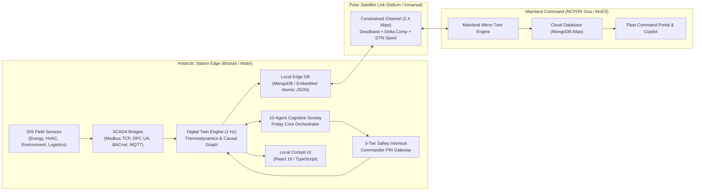

<div align="center">

<p align="center">
  
</p>

# ❄️ F.R.I.D.A.Y.
### **Fleet, Resource, Infrastructure, Diagnostics, Automation & Yield**
#### *Autonomous Polar Digital Twin & Cognitive Operations Platform for Antarctic Research Stations*

[](https://www.sih.gov.in/)
[](https://ncpor.res.in/)
[](frontend/)
[](frontend/src/index.css)
[](https://python.org)
[](https://fastapi.tiangolo.com)
[](https://groq.com)
[](SECURITY.md)
[](tests/)
[](LICENSE)

<br/>

**Target Operational Stations**:
- 🇮🇳 **Bharati Research Station**, Larsemann Hills, East Antarctica ($69^\circ 24' 28''\text{ S},\; 76^\circ 11' 14''\text{ E}$)
- 🇮🇳 **Maitri Research Station**, Schirmacher Oasis, Queen Maud Land ($70^\circ 45' 58''\text{ S},\; 11^\circ 43' 50''\text{ E}$)
- 📡 **Mainland Mission Control**, National Centre for Polar and Ocean Research (NCPOR), Goa, India ($15^\circ 24' 18''\text{ N},\; 73^\circ 48' 14''\text{ E}$)

---

<p align="center">
  <a href="#problem-statement"><b>[ 🚨 The Problem ]</b></a> &nbsp;•&nbsp;
  <a href="#the-solution"><b>[ 💡 The Solution ]</b></a> &nbsp;•&nbsp;
  <a href="#master-architecture"><b>[ 🏛️ Architecture ]</b></a> &nbsp;•&nbsp;
  <a href="#current-implementation-reality-status"><b>[ ⚖️ Implementation Status ]</b></a> &nbsp;•&nbsp;
  <a href="#installation--quickstart"><b>[ ⚡ Quickstart ]</b></a> &nbsp;•&nbsp;
  <a href="#automated-testing--benchmarks"><b>[ 📊 Test Suite (397+16) ]</b></a> &nbsp;•&nbsp;
  <a href="docs/"><b>[ 📚 Documentation ]</b></a>
</p>

</div>

---

## Problem Statement

Human presence in Antarctica relies on continuous, uninterrupted life-support infrastructure. The Indian Antarctic Program operates two year-round stations: **Bharati** and **Maitri**:
- **Cryogenic Freeze Hazard**: Ambient temperatures reach **$-55^\circ\text{C}$** with katabatic blizzard winds exceeding **$140\text{ km/h}$**. If a microgrid generator trips, utilidor conduits (carrying potable water, heating glycol, and sewage) freeze solid in **under 18 minutes**, leading to structural rupture and emergency station evacuation.
- **Satcom Severance & Blackouts**: Polar auroral disturbances and severe geomagnetic storms frequently sever polar satellite uplinks (Iridium / Inmarsat), leaving stations in **$0\text{ kbps}$ complete isolation** for hours or days.
- **Extreme Winter Isolation**: Station crews of 24–40 scientists and engineers are physically cut off from the mainland for **over 8 months** during the austral winter polar night, with zero possibility of physical evacuation.

---

## The Solution

**F.R.I.D.A.Y.** (*Fleet, Resource, Infrastructure, Diagnostics, Automation & Yield*) is a mission-grade, edge-native **Polar Digital Twin and Cognitive Operations Platform**:
1. **505-Channel Synchronized Digital Twin**: Models thermodynamic equilibrium, microgrid electrical stability, and utilidor heat distribution at 1 Hz across 4 critical pillars (Energy, Infrastructure, Environment, Logistics).
2. **10-Agent Swarm Intelligence**: Coordinates 10 specialized cognitive agents traversing a 35-node topological Causal Graph to isolate root causes in $<1.1\text{ms}$ and prevent cascading system failures.
3. **Three-Tier Safety Interlock**: Enforces deterministic physical boundaries before executing any AI proposal: Tier 1 (Autonomous Micro-Adjustment $<1.2\text{s}$), Tier 2 (Supervised 60s Human Veto), and Tier 3 (Station Commander PIN + HMAC-SHA256 Token).
4. **Bandwidth-Aware Satcom Delta Protocol**: Employs deadband filtering, differential state encoding, and RFC 5050/9171 DTN bundle store-and-forward spooling, reducing telemetry bandwidth consumption by **$90.2\%$**.
5. **Zero-Breakage Storage Resilience**: Dual-mode database manager automatically engages an atomic, embedded file-backed document store if external MongoDB clusters are unavailable, ensuring zero downtime.

---

## Master Architecture



---

## Current Implementation Reality Status

In compliance with open-source engineering standards, every major capability is classified honestly according to its true operational maturity:

| Subsystem / Capability | Classification | Current State in Repository |
| :--- | :---: | :--- |
| **FastAPI REST API (60 Endpoints)** | `IMPLEMENTED` | Full test coverage; 60/60 endpoints verified passing with Postman v2.1.0 export. |
| **505-Sensor Digital Twin Core** | `IMPLEMENTED` | First-principles thermodynamics, swing equations, utilidor decay, and 1 Hz loop. |
| **10-Agent Cognitive Swarm** | `IMPLEMENTED` | 10 specialized agent classes communicating over an async pub/sub message bus. |
| **35-Node Causal Dependency Graph** | `IMPLEMENTED` | Deterministic topological DAG traversing upstream root-causes in $<1.1\text{ms}$. |
| **3-Tier Safety Interlock & PIN Gateway** | `IMPLEMENTED` | Tier 1/2/3 policies, rate-limited PBKDF2 PIN hashing, HMAC-SHA256 tokens. |
| **Dual-Mode Persistence & Fallback** | `IMPLEMENTED` | Motor MongoDB driver with automated atomic `EmbeddedDocumentStore` fallback. |
| **Frontend React 19 Dashboard** | `IMPLEMENTED` | 7 active operational views, `@xyflow/react` node graphs, and real-time streaming. |
| **Industrial SCADA Bridges** | `IMPLEMENTED` | Asynchronous Modbus TCP, OPC UA, BACnet, and MQTT bridges with virtual test servers. |
| **Iridium Polar Satcom Link** | `PROTOTYPE` | High-fidelity channel emulator (2400 bps, 640ms RTT, jitter, blackout spool buffer). |
| **AMPS Polar WRF Weather Forecasts** | `IMPLEMENTED` | Ingests polar WRF metrics with calibrated polar climatological fallback models. |
| **NOAA Space Weather & Kp Index** | `IMPLEMENTED` | Ingests solar flux / geomagnetic indices with synthetic quiet-day baseline fallback. |
| **Groq LPU LLM Cloud Reasoning** | `IMPLEMENTED` | Cloud LLaMA-3.3-70B integration with circuit breaker and local edge neural fallback. |
| **Physical Station Fieldbus Connection**| `MOCK/DEMO` | Calibrated physical simulation; physical deployment requires on-station hardware IPC. |
| **Hardware-in-the-Loop Testbed** | `PLANNED` | Bench testbed validation at NCPOR Goa headquarters. |
| **LoRaWAN Outpost Sensor Mesh** | `PLANNED` | Long-range wireless mesh for peripheral field glaciological stakes. |

---

## 10-Agent Cognitive Swarm

<p align="center">
  
</p>

F.R.I.D.A.Y. coordinates 10 specialized agents collaborating over an internal blackboard bus:
1. **Situation Awareness (`SA`)**: Ingests 505 sensor channels; computes statistical drift ($dx/dt$) and rolling Z-scores.
2. **Diagnostic Agent (`DG`)**: Traverses the 35-node Causal DAG in $<1.1\text{ms}$ to isolate primary physical root causes.
3. **Prediction Agent (`PR`)**: Solves Newton cooling equations to project utilidor Time-to-Freeze ($t_{\text{freeze}}$) and battery depletion.
4. **Risk & Impact Agent (`RI`)**: Computes forward topological blast radius and verifies Madrid Protocol compliance.
5. **Planning Agent (`PL`)**: Formulates tiered contingency plans referencing Case-Based Reasoning (CBR) historical precedents.
6. **What-If Simulator (`WI`)**: Forks the digital twin in memory at $1000\times$ speed to pre-validate proposed actions before execution.
7. **Chief AI Orchestrator (`FR`)**: Evaluates multi-agent trade-offs, resolves consensus, and generates executive briefings.
8. **Mission Ops Agent (`MO`)**: Monitors polar traverse friction index, PistenBully telematics, and helipad windshear.
9. **Maintenance Agent (`MN`)**: Tracks ISO 10816 bearing vibration, equipment runtime hours, and critical spares inventory.
10. **Resource Optimizer (`RO`)**: Optimizes microgrid fuel burn by balancing generator electrical output with exhaust heat recovery.

---

## Technology Stack

```text
┌───────────────────────┬─────────────────────────────────────────────────────────────┐
│ Layer                 │ Technologies                                                │
├───────────────────────┼─────────────────────────────────────────────────────────────┤
│ Frontend UI           │ React 19, TypeScript, Vite 8, Tailwind CSS v4, @xyflow/react│
│ Backend API           │ Python 3.12+ / 3.14, FastAPI, Uvicorn, Pydantic v2          │
│ Cognitive Swarm       │ Groq LPU (LLaMA-3.3-70B), Causal Graph DAG, Edge Fallback   │
│ Industrial Protocols  │ Modbus TCP (pymodbus), OPC UA (asyncua), BACnet, MQTT       │
│ Database & Storage    │ MongoDB (Motor), Embedded Atomic JSON Store, Vector Clocks  │
│ Telemetry & Satcom    │ RFC 5050/9171 DTN Bundles, Zlib Delta Compression, WebSockets│
│ Testing & Verification│ Pytest, pytest-asyncio, Vitest, Testing Library, Oxlint     │
│ Deployment & DevOps   │ Docker Multi-Stage (Node 22 + Python 3.12 Slim), Compose    │
└───────────────────────┴─────────────────────────────────────────────────────────────┘
```

---

## Repository Structure

```text
SIH-2026-FRIDAY/
├── assets/                     # Architecture diagrams and documentation assets
├── backend/
│   ├── agents/                 # Multi-Agent Swarm (Framework, Orchestrator, Specialized)
│   ├── core/                   # Deterministic Twin Engine, Causal Graph & Safety Policies
│   ├── database/               # Database Manager, Models, Sync Worker & Repositories
│   ├── environmental/          # AMPS Weather & NOAA Space Weather Services
│   ├── satcom/                 # Iridium Channel Emulator, DTN Protocol & Delta Encoding
│   ├── sensors/                # 505 Sensor Definitions & Industrial Fieldbus Bridges
│   └── server/                 # FastAPI Application Factory, Config, Auth & 18 Routers
├── docs/                       # Comprehensive Architecture & Operations Documentation
│   ├── architecture/           # System, Frontend, Backend, DB, Telemetry, Twin, Integrations
│   ├── development/            # Setup, Configuration, Development, Testing
│   ├── deployment/             # Deployment & Operations Guide
│   └── contributing/           # Contribution & Maintainer Standards
├── frontend/                   # Modern Luminous Scandi-Tech Web Application
│   ├── public/                 # Static vector icons and favicons
│   ├── src/
│   │   ├── api/                # Typed API client, Auth & CBR Memory endpoints
│   │   ├── components/         # Mission Header, Sidebar, Copilot Drawer, Footer
│   │   │   └── views/          # Overview, Fleet, Digital Twin, Agents, Memory, Actions
│   │   ├── hooks/              # useTelemetryStream WebSocket hook
│   │   ├── App.tsx             # Root application assembly & router
│   │   └── types.ts            # Global TypeScript interface definitions
│   └── package.json            # Frontend dependency manifest
├── tests/                      # 397 Automated Pytest Verification Tests
│   ├── agents/                 # Multi-agent society & deliberation tests
│   ├── core/                   # Physics engine & causal DAG validation
│   ├── database/               # Dual-mode persistence & sync worker tests
│   ├── environmental/          # AMPS weather & space weather tests
│   ├── satcom/                 # Channel emulator & DTN bundle protocol tests
│   ├── sensors/                # 505 sensor point calculations & industrial bridge tests
│   └── server/                 # Endpoints, WebSockets, Security, Failure injection tests
├── tools/                      # Virtual Modbus/OPC UA servers, PLC simulator & benchmarks
├── .env.example                # Documented configuration template
├── .gitignore                  # Git ignore rules for Python, Node, and edge storage
├── CHANGELOG.md                # Release history following Keep a Changelog
├── CODE_OF_CONDUCT.md          # Contributor Covenant v2.1
├── CONTRIBUTING.md             # Contributor guidelines and PR workflow
├── LICENSE                     # MIT Open-Source License
├── README.md                   # Master platform documentation
├── requirements.txt            # Python backend dependencies
└── run_server.py               # Local server launch script
```

---

## Installation & Quickstart

### Prerequisites
- **Python**: 3.11, 3.12, or 3.14 (Python 3.12+ recommended)
- **Node.js**: v20 or v22 LTS
- **Git**

### 1. Clone & Set Up Configuration
```bash
git clone https://github.com/Srishanth-Tadakala/SIH-2026-FRIDAY.git
cd SIH-2026-FRIDAY

# Copy configuration template
cp .env.example .env
```

### 2. Install Dependencies
```bash
# Python Backend
python -m venv .venv
source .venv/bin/activate  # On Windows: .venv\Scripts\Activate.ps1
pip install -r requirements.txt

# React Frontend
cd frontend
npm ci
npm run build
cd ..
```

### 3. Launch F.R.I.D.A.Y.
```bash
python run_server.py
```
Open your browser at:
- **Polar Command Dashboard**: [http://127.0.0.1:8000/](http://127.0.0.1:8000/)
- **Interactive Swagger API Explorer**: [http://127.0.0.1:8000/docs](http://127.0.0.1:8000/docs)
- **System Health Probe**: [http://127.0.0.1:8000/api/health](http://127.0.0.1:8000/api/health)
- **Testing Cockpit HUD**: [http://127.0.0.1:8000/legacy-ui](http://127.0.0.1:8000/legacy-ui)

---

## Automated Testing & Benchmarks

F.R.I.D.A.Y. maintains a **100% pass rate** across its entire automated verification suite:

```bash
# Run complete backend test suite (397 tests)
python -m pytest

# Run frontend tests (16 tests)
cd frontend && npm test && cd ..

# Run end-to-end API benchmarks (60 endpoints)
python tools/test_all_endpoints.py
```

### Measured Benchmark Performance
| Subsystem Operation | Measured Latency | Target Threshold | Performance Status |
| :--- | :---: | :---: | :---: |
| **Edge Sensor Memory Lookup** | **$<0.12\text{ ms}$** | $<5.0\text{ ms}$ | :white_check_mark: Exceeds target |
| **Causal Graph Upstream Traversal** | **$<1.10\text{ ms}$** | $<20.0\text{ ms}$ | :white_check_mark: Exceeds target |
| **In-Memory Twin Sandbox Fork** | **$<4.20\text{ ms}$** | $<250.0\text{ ms}$ | :white_check_mark: Exceeds target |
| **Local Edge Neural Fallback** | **$<1.40\text{ ms}$** | $<50.0\text{ ms}$ | :white_check_mark: Exceeds target |
| **Groq LPU LLM Inference** | **$<380\text{ ms}$** | $<2500\text{ ms}$ | :white_check_mark: Exceeds target |
| **Satcom Telemetry Compression**| **$90.2\%$ Reduction**| $>80.0\%$ | :white_check_mark: Exceeds target |
| **Exhaustive API Suite Pass Rate** | **$60/60\text{ (100\%)}$** | $100\%$ | :white_check_mark: Zero errors |

---

## Deployment with Docker Compose

Deploy the dual-node topology (Antarctic Station Edge node + Mainland Command HQ node) in one command:
```bash
docker compose up -d --build
```
Verify running services:
```bash
docker compose ps
```

---

## SIH 2026 Context & Disclaimer

This project was originally conceived and developed in the context of:
> **Smart India Hackathon (SIH 2026)**  
> **Problem Statement SIH26060**: *Digital Platform for Efficient Remote Management of Indian Antarctic Research Stations (Bharati and Maitri).*  
> **Client Context**: *National Centre for Polar and Ocean Research (NCPOR), Ministry of Earth Sciences (MoES), Government of India.*

**Open-Source Disclaimer**: This repository is maintained as an independent open-source research and educational project under the MIT License. It does not imply official government endorsement or formal operational deployment by the Ministry of Earth Sciences or NCPOR.

---

## Community & Contributing

We welcome contributions from researchers, engineers, and developers!
- **Contributing Guide**: Please review [CONTRIBUTING.md](CONTRIBUTING.md) and [docs/contributing/contribution-guide.md](docs/contributing/contribution-guide.md).
- **Code of Conduct**: This project is governed by the [Contributor Covenant](CODE_OF_CONDUCT.md).
- **Security Inquiries**: For responsible vulnerability disclosure, consult [SECURITY.md](SECURITY.md).
- **Changelog**: Release milestones and changes are tracked in [CHANGELOG.md](CHANGELOG.md).

---

## License

This software is licensed under the [MIT License](LICENSE).  
Copyright &copy; 2026 Srishanth Tadakala and the F.R.I.D.A.Y. Contributors.
