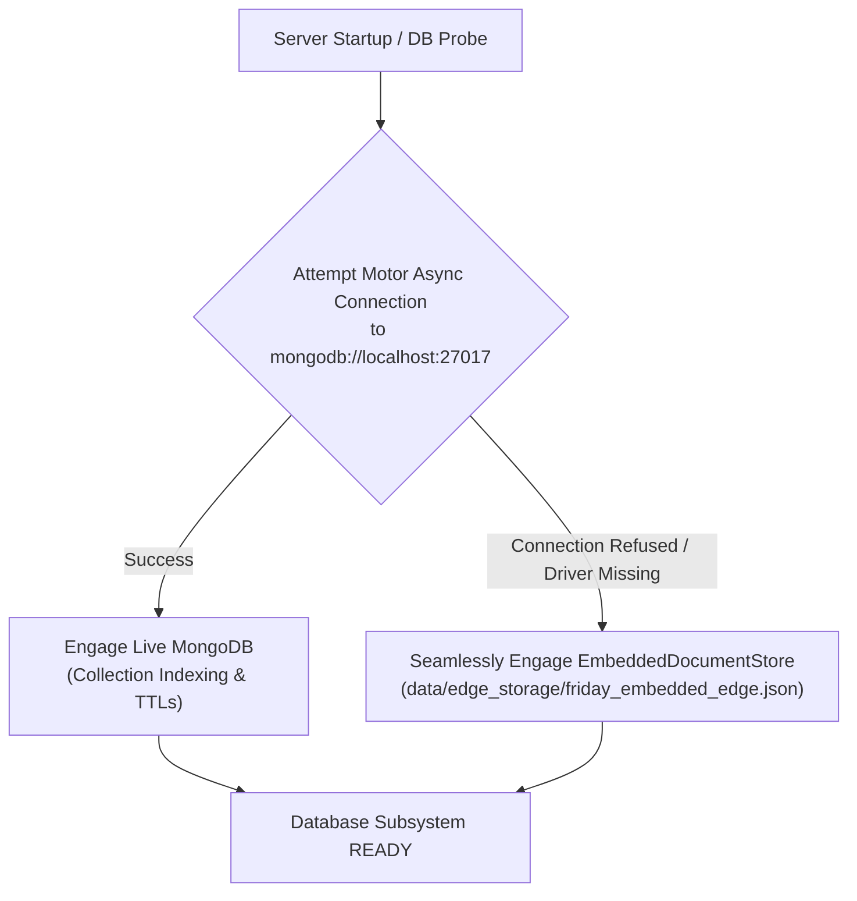

# Database Architecture & Persistence Layer

## 2-Step Distributed Architecture

F.R.I.D.A.Y. utilizes a 2-step distributed data architecture tailored for intermittent, bandwidth-constrained polar satcom links:

```text
┌────────────────────────────────────────┐         ┌────────────────────────────────────────┐
│      LOCAL STATION EDGE DATABASE       │         │       MAINLAND HQ CLOUD DATABASE       │
│      (Bharati / Maitri Outposts)       │         │          (NCPOR Goa / MoES)            │
├────────────────────────────────────────┤         ├────────────────────────────────────────┤
│ • MongoDB Local / Embedded Atomic Store│         │ • MongoDB Atlas Scalable Cloud Cluster │
│ • High-frequency 1 Hz operational state│  Satcom │ • Fleet-wide long-term intelligence    │
│ • Local incident CBR memory bank       │ ══════> │ • Historical episode archives          │
│ • Zero-downtime offline persistence    │  Delta  │ • Multi-year equipment wear analytics  │
│ • Bounded local disk storage footprint │  Sync   │ • Cross-expedition copilot corpora     │
└────────────────────────────────────────┘         └────────────────────────────────────────┘
```

---

## Zero-Breakage Dual-Mode Engine

A critical challenge in Antarctic edge deployments is that local database servers may encounter power outages, crash, or fail to start. F.R.I.D.A.Y. guarantees that the server and digital twin loop never fail due to database unavailability via its `DatabaseManager` in `backend/database/connection.py`:



### Embedded Document Store Guarantees
- **Async MongoDB-Compatible API**: Implements `insert_one`, `find`, `find_one`, `update_one`, `delete_many`, and `count_documents`.
- **Atomic Disk Writes**: Every mutation writes to a temporary file (`.tmp`) and utilizes atomic OS-level file replace (`os.replace`) to guarantee zero corruption upon sudden power cutoff.
- **In-Memory Query Acceleration**: Maintains cached collections in memory for sub-millisecond retrieval.

---

## Schema & Collections Inventory

| Collection Name | Repository Module | Document Purpose | Retention Policy |
| :--- | :--- | :--- | :--- |
| `telemetry_timeseries` | `telemetry_repo.py` | 1 Hz sensor readings and derived KPIs. | Edge: 7 days rolling / Cloud: Permanent |
| `incident_episodes` | `episodes_repo.py` | Recorded crisis events, root-cause isolation, and resolution paths. | Permanent |
| `memory_records` | `memory_repo.py` | Case-Based Reasoning (CBR) operational experiences with semantic tags. | Permanent |
| `memory_retrievals` | `memory_repo.py` | Audit logs of when memories were recalled to guide real-time decisions. | 90 days |
| `equipment_lifecycle`| `equipment_repo.py` | Runtime hours, thermal cycles, maintenance milestones, wear scores. | Permanent |
| `operator_audits` | `audit_repo.py` | Cryptographically signed logs of all human commands and PIN approvals. | Permanent |
| `copilot_dialogues` | `copilot_repo.py` | Conversations, suggested queries, and reasoning traces with Friday Copilot. | 180 days |
| `state_sync_records`| `state_sync_repo.py`| Vector clocks, sync checksums, and satcom transmission verification logs. | 30 days |

---

## Satcom Synchronization Worker

The background worker in `backend/database/sync_worker.py` periodically synchronizes data between the local station edge and mainland cloud:
1. **Change Batching**: Collects newly inserted episode, audit, and memory records since the last sync watermark.
2. **Bandwidth Guarding**: Pauses transmission when the satcom emulator reports connection blackouts ($0\text{ kbps}$) or high queue congestion.
3. **Custody Transfer**: Confirms remote reception before clearing local spool buffers.
