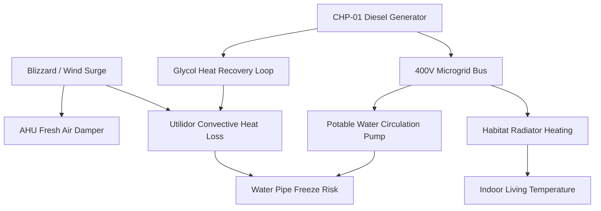

# Deterministic Digital Twin & Physics Engine

## Physics-Grounded State Representation

Unlike pure LLM wrappers or synthetic mocks, F.R.I.D.A.Y.'s digital twin is grounded in first-principles physics equations implemented in `backend/core/engine.py`.

### 1. Thermal Equilibrium & Utilidor Decay
The indoor module temperature $T_{\text{in}}$ and utilidor conduit temperature $T_{\text{util}}$ evolve according to coupled first-order differential equations:

$$\frac{dT_{\text{in}}}{dt} = \frac{1}{C_{\text{thermal}}} \left[ Q_{\text{CHP}} + Q_{\text{aux}} - U_{\text{wall}} A (T_{\text{in}} - T_{\text{amb}}) - \dot{m}_{\text{vent}} c_p (T_{\text{in}} - T_{\text{amb}}) \right]$$

- $C_{\text{thermal}}$: Effective thermal capacitance of the insulated station habitat ($J/K$).
- $Q_{\text{CHP}}$: Waste heat recovered from running diesel generators via plate heat exchangers ($W$).
- $U_{\text{wall}}$: Overall thermal transmittance of vacuum-insulated sandwich panels ($W/m^2\cdot K$).
- $\dot{m}_{\text{vent}}$: Fresh air intake mass flow rate ($kg/s$).

### 2. Microgrid Electrical Frequency Stability
Microgrid rotational inertia and electrical frequency balance are modeled using the swing equation:

$$2H \frac{df}{dt} = P_{\text{mech}} - P_{\text{elec}} - D(f - f_0)$$

- $f_0 = 50.00\text{ Hz}$: Nominal grid frequency.
- When an active generator trips ($P_{\text{mech}}$ drops), grid frequency dips below the critical $49.20\text{ Hz}$ load-shedding threshold within 650 ms, triggering autonomous Tier 1 ATS interlocks.

---

## 35-Node Causal Graph (`causal_graph.py`)

To eliminate LLM hallucination during crisis events, F.R.I.D.A.Y. utilizes a deterministic Directed Acyclic Graph (DAG) representing 35 physical and functional dependencies:

### Causal Traversal & Root-Cause Isolation
When anomalous sensor readings are detected by the Situation Awareness Agent:
1. The Diagnostic Agent traverses the DAG backwards from symptom nodes to identify upstream root causes.
2. The Risk Impact Agent traverses downstream edges to compute the cascading blast radius (identifying systems at risk of failure in the next 10–30 minutes).

---

## Counterfactual Predictive Sandbox (`sandbox.py`)

Before any Tier 2 or Tier 3 action proposal is presented to human operators or scheduled for execution:
1. **Fork State**: The active digital twin state space is deep-copied in memory.
2. **Inject Candidate Action**: The proposed control actuation (e.g., cutting off secondary scientific laboratories to conserve emergency microgrid power) is applied to the forked twin.
3. **Fast-Forward Simulation**: The sandbox advances physics time forward by 120–600 seconds at $1000\times$ real-time speed.
4. **Invariant Verification**: The sandbox verifies that:
   - Indoor habitat temperature stays $\ge 16.0^\circ\text{C}$.
   - Utilidor glycol loop stays $\ge 4.0^\circ\text{C}$.
   - Grid frequency remains within $49.5\text{–}50.5\text{ Hz}$.
5. **Confidence Rating**: Only plans passing all safety invariant gates with $\ge 95\%$ confidence are cleared for operator confirmation.
