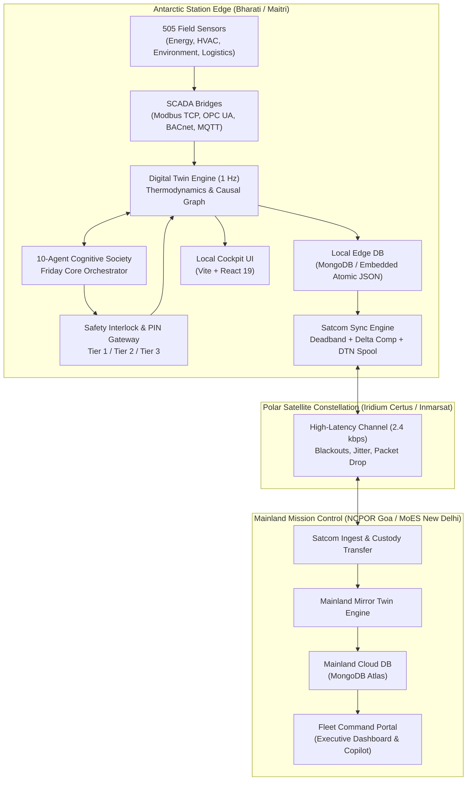

# System Architecture & Component Specification

## End-to-End System Topology

F.R.I.D.A.Y. links remote Antarctic research stations with mainland mission headquarters across a distributed, multi-tiered architecture:

---

## Architectural Layers

### 1. Presentation Layer (Frontend)
- **Framework**: React 19 + TypeScript + Vite.
- **Styling**: Tailwind CSS v4 with bespoke Luminous Scandi-Tech visual design system.
- **Workflow & Node Graphing**: `@xyflow/react` for interactive multi-agent deliberation DAGs and digital twin topological flow diagrams.
- **Telemetry Streaming**: Real-time multiplexed WebSocket channels (`/ws/telemetry/{station_id}`) with backpressure management.

### 2. API & Observability Gateway
- **Web Framework**: FastAPI running under Uvicorn ASGI server.
- **Authentication**: Salted PBKDF2-HMAC-SHA256 password hashing and cryptographic JWT bearer tokens (`HS256`).
- **Authorization**: 5-Tier RBAC hierarchy (`VIEWER` $\to$ `OPERATOR` $\to$ `ENGINEER` $\to$ `COMMANDER` $\to$ `ADMIN`).
- **Health Probes**: Dedicated Kubernetes and container liveness (`/health/liveness`) and readiness (`/health/readiness`) endpoints.
- **REST Endpoints**: 60 validated endpoints covering stations, telemetry, actions, deliberations, satcom, database, copilot, and environmental data.

### 3. Swarm Intelligence & Cognitive Agent Core
- **Architecture**: 10-Agent Autonomous Deliberation Society.
- **Message Bus**: High-performance asynchronous pub/sub blackboard with topic filtering and historical retention.
- **Reasoning**:
  - Cloud Cognitive Engine: Groq LPU (LLaMA-3.3-70B) for ultra-fast conversational and deep causal deliberation.
  - Fallback Engine: Deterministic local rule and neural fallback executing in $<1.4\text{ms}$ with automated circuit breaking (3 consecutive errors trip breaker for 60s).
- **Causal Reasoning**: 35-node topological causal dependency graph for automated root-cause fault isolation.

### 4. Deterministic Polar Digital Twin Engine
- **State Space**: 505 continuous physical sensor channels across Bharati and Maitri stations.
- **4 Operational Pillars**:
  1. **Energy & Microgrid**: Combined Heat & Power (CHP) diesel generators, battery banks, solar arrays, wind turbines, ATS switches, bus frequency ($50.00\text{ Hz}$).
  2. **Infrastructure & Life Support**: Building Management System (BMS), utilidor glycol trace heating, potable water reserves, wastewater treatment, fire suppression.
  3. **Environmental & Weather**: Katabatic wind speed, ambient temperature, atmospheric pressure, blowing snow transport, solar radiation.
  4. **Logistics & Fleet Operations**: Fuel bladder reserves, aviation kerosene, PistenBully tracked vehicles, snowmobiles, cold-chain storage.
- **Simulation Frequency**: 1 Hz continuous autonomous governor loop.
- **Counterfactual Sandbox**: Clones twin state to test proposed actions over a 1000x accelerated timeline before deployment.

### 5. Polar Satcom Subsystem
- **Channel Emulator**: Simulates real-world polar satellite link conditions (2400 bps bandwidth, 640ms RTT, jitter, and intermittent blackout periods).
- **Compression**: Deadband threshold filtering combined with differential state delta compression, yielding $90.2\%$ bandwidth reduction.
- **DTN Bundle Protocol**: RFC 5050 / RFC 9171 Delay-Tolerant Networking implementation with custody transfer for 100% telemetry preservation during multi-hour solar blackouts.

### 6. Persistence & Storage Subsystem
- **Dual-Mode Engine**: Native MongoDB driver (`motor` async) for local and cloud database clusters.
- **Embedded Document Store**: High-performance, atomic, file-backed JSON document store in `data/edge_storage/` ensuring zero downtime when external databases are unavailable.
