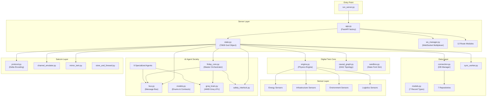
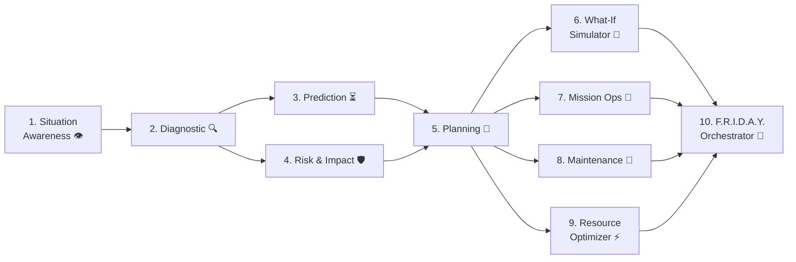
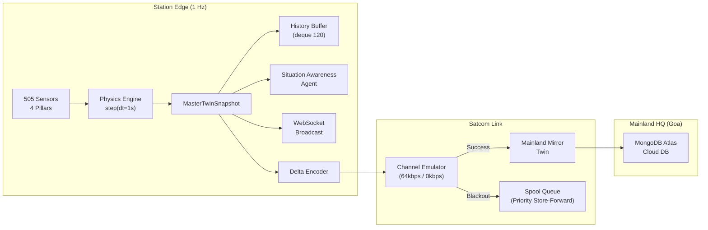
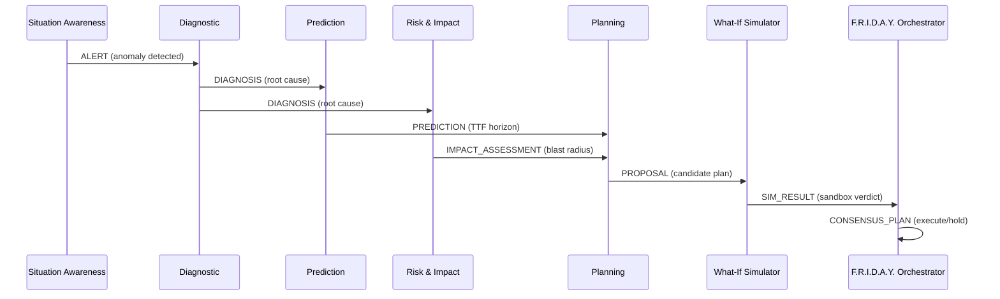
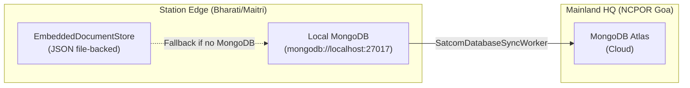

# F.R.I.D.A.Y. — Complete Pin-to-Pin Architectural Analysis

> **Project**: F.R.I.D.A.Y. (Futuristic Resource Intelligence & Digital Assistant for Yearly operations)
> **SIH ID**: SIH26060 — Smart India Hackathon 2026
> **Mission**: Digital Platform for Efficient Remote Management of Indian Antarctic Research Stations
> **Target**: Bharati Station & Maitri Station, East Antarctica ↔ NCPOR Goa Mainland HQ
> **Analysis Date**: 2026-09-27
> **Auditor Role**: Principal Software Architect / Senior AI Engineer / Security Engineer / Codebase Auditor

---

## Table of Contents
1. [Workspace Discovery](#1-workspace-discovery)
2. [Component Map & Module Inventory](#2-component-map--module-inventory)
3. [AI / Agent Analysis](#3-ai--agent-analysis)
4. [Security Audit](#4-security-audit)
5. [Data Flow Architecture](#5-data-flow-architecture)
6. [Control Flow & Event System](#6-control-flow--event-system)
7. [API Surface Analysis](#7-api-surface-analysis)
8. [Database Architecture](#8-database-architecture)
9. [Frontend Architecture](#9-frontend-architecture)
10. [Frontend-Backend Communication](#10-frontend-backend-communication)
11. [Configuration & Environment](#11-configuration--environment)
12. [Dependency Analysis](#12-dependency-analysis)
13. [Testing Infrastructure](#13-testing-infrastructure)
14. [Build & Run Process](#14-build--run-process)
15. [Deployment Architecture](#15-deployment-architecture)
16. [Performance & Scalability](#16-performance--scalability)
17. [Error Handling & Resilience](#17-error-handling--resilience)
18. [Code Quality & Patterns](#18-code-quality--patterns)
19. [Critical Risks & Gaps](#19-critical-risks--gaps)
20. [Summary Scorecard & Recommendations](#20-summary-scorecard--recommendations)

---

## 1. Workspace Discovery

### 1.1 Repository Metrics

| Metric | Value |
|---|---|
| **Total Commits** | 109 (single branch: `main`) |
| **VCS** | Git, remote `origin/main` |
| **Source Files (excl. config/JSON)** | ~210 files |
| **Backend Python Code** | 171 files, **1,631 KB** |
| **Frontend TypeScript/React** | 30 files, **374 KB** |
| **Total Application Code** | ~**2,287 KB** (~2.2 MB) |
| **License** | [LICENSE](file:///c:/Users/siddu/OneDrive/Desktop/F.R.I.D.A.Y/LICENSE) (MIT) |
| **README** | [README.md](file:///c:/Users/siddu/OneDrive/Desktop/F.R.I.D.A.Y/README.md) — 60 KB comprehensive walkthrough |

### 1.2 Root Directory Structure

```
F.R.I.D.A.Y/
├── backend/           # Python FastAPI application (core logic)
│   ├── agents/        # 10-agent cognitive AI society
│   ├── core/          # Digital twin engine, causal graph, sandbox
│   ├── database/      # 2-step distributed DB (Edge + Cloud)
│   ├── satcom/        # Polar satellite communication emulation
│   ├── sensors/       # 505-point sensor simulation (4 pillars)
│   └── server/        # FastAPI app, routes, state, WebSocket
├── frontend/          # React 19 + Vite 8 + TailwindCSS 4 + React Flow
│   └── src/           # Components, views, hooks, API layer
├── tests/             # Comprehensive pytest suite (28 test files)
├── tools/             # PLC simulator & endpoint tester
├── data/edge_storage/ # Local embedded document store persistence
├── run_server.py      # Entry point
├── requirements.txt   # Python dependencies
├── .env               # Secrets (gitignored)
└── .env.example       # Secret template
```

### 1.3 Infrastructure / DevOps Findings

> [!IMPORTANT]
> **No Dockerfile, docker-compose, CI/CD pipeline, or Kubernetes manifests exist.**
> The project runs purely as a local development server. There is no containerization or deployment automation whatsoever.

---

## 2. Component Map & Module Inventory

### 2.1 Backend Module Graph



### 2.2 Route Modules (12 REST API routers)

| Route File | Prefix | Purpose |
|---|---|---|
| [`stations.py`](file:///c:/Users/siddu/OneDrive/Desktop/F.R.I.D.A.Y/backend/server/routes/stations.py) | `/api/stations` | Dual-station fleet & switching |
| [`telemetry.py`](file:///c:/Users/siddu/OneDrive/Desktop/F.R.I.D.A.Y/backend/server/routes/telemetry.py) | `/api/telemetry` | 505-sensor snapshot & history |
| [`telemetry_ingest.py`](file:///c:/Users/siddu/OneDrive/Desktop/F.R.I.D.A.Y/backend/server/routes/telemetry_ingest.py) | `/api/telemetry/ingest` | External PLC data injection |
| [`agents.py`](file:///c:/Users/siddu/OneDrive/Desktop/F.R.I.D.A.Y/backend/server/routes/agents.py) | `/api/agents` | Agent society status & bus |
| [`deliberations.py`](file:///c:/Users/siddu/OneDrive/Desktop/F.R.I.D.A.Y/backend/server/routes/deliberations.py) | `/api/deliberations` | Deliberation session blackboard |
| [`actions.py`](file:///c:/Users/siddu/OneDrive/Desktop/F.R.I.D.A.Y/backend/server/routes/actions.py) | `/api/actions` | Tiered action execution & PIN gate |
| [`scenarios.py`](file:///c:/Users/siddu/OneDrive/Desktop/F.R.I.D.A.Y/backend/server/routes/scenarios.py) | `/api/scenarios` | Crisis scenario injection/clear |
| [`satcom.py`](file:///c:/Users/siddu/OneDrive/Desktop/F.R.I.D.A.Y/backend/server/routes/satcom.py) | `/api/satcom` | Satcom profile, recovery, metrics |
| [`copilot.py`](file:///c:/Users/siddu/OneDrive/Desktop/F.R.I.D.A.Y/backend/server/routes/copilot.py) | `/api/copilot` | Ask F.R.I.D.A.Y. AI chat |
| [`database.py`](file:///c:/Users/siddu/OneDrive/Desktop/F.R.I.D.A.Y/backend/server/routes/database.py) | `/api/database` | DB health & episode query |
| [`sync.py`](file:///c:/Users/siddu/OneDrive/Desktop/F.R.I.D.A.Y/backend/server/routes/sync.py) | `/api/sync` | Edge ↔ Cloud sync operations |
| [`ws.py`](file:///c:/Users/siddu/OneDrive/Desktop/F.R.I.D.A.Y/backend/server/routes/ws.py) | `/ws/telemetry` | WebSocket endpoint |

### 2.3 Sensor Simulation (505 Points)

The sensor layer is organized into **4 observation pillars**:

| Pillar | Directory | Sensors | Domain |
|---|---|---|---|
| **Energy** | `sensors/bharati_sensors/energy/` | CHP generators, MLVD bus, fuel, solar, battery | Power generation & distribution |
| **Infrastructure** | `sensors/bharati_sensors/infrastructure/` | HVAC, building zones, utilidor pipelines, water/RO | Building systems & life-support |
| **Environment** | `sensors/bharati_sensors/environment/` | Ambient temp, wind, UV, snow load, sea ice | External polar conditions |
| **Logistics** | `sensors/bharati_sensors/logistics/` | Vehicles, cargo, supply chain, cold chain | Operational logistics |

Each pillar has its own `factory.py`, `registry.py`, `models.py`, and `physics.py` providing deterministic first-principles simulation.

---

## 3. AI / Agent Analysis

### 3.1 Agent Society Architecture

The system implements a **10-agent cognitive society** with a message-bus-driven deliberation pipeline:



### 3.2 Agent Roster

| # | Agent | File | Role |
|---|---|---|---|
| 1 | Situation Awareness | [`situation_awareness.py`](file:///c:/Users/siddu/OneDrive/Desktop/F.R.I.D.A.Y/backend/agents/specialized/situation_awareness.py) (19KB) | Continuous 505-sensor anomaly detection |
| 2 | Diagnostic | [`diagnostic.py`](file:///c:/Users/siddu/OneDrive/Desktop/F.R.I.D.A.Y/backend/agents/specialized/diagnostic.py) (24KB) | Bayesian causal DAG root-cause isolation |
| 3 | Prediction | [`prediction.py`](file:///c:/Users/siddu/OneDrive/Desktop/F.R.I.D.A.Y/backend/agents/specialized/prediction.py) (17KB) | Physics forward-lookahead TTF projection |
| 4 | Risk & Impact | [`risk_impact.py`](file:///c:/Users/siddu/OneDrive/Desktop/F.R.I.D.A.Y/backend/agents/specialized/risk_impact.py) (13KB) | Blast radius & criticality scoring |
| 5 | Planning | [`planning.py`](file:///c:/Users/siddu/OneDrive/Desktop/F.R.I.D.A.Y/backend/agents/specialized/planning.py) (10KB) | Tiered mitigation plan formulation |
| 6 | What-If Simulator | [`what_if.py`](file:///c:/Users/siddu/OneDrive/Desktop/F.R.I.D.A.Y/backend/agents/specialized/what_if.py) (17KB) | Sandbox digital twin verification |
| 7 | Mission Operations | [`mission_ops.py`](file:///c:/Users/siddu/OneDrive/Desktop/F.R.I.D.A.Y/backend/agents/specialized/mission_ops.py) (18KB) | Scientific payload protection |
| 8 | Maintenance | [`maintenance.py`](file:///c:/Users/siddu/OneDrive/Desktop/F.R.I.D.A.Y/backend/agents/specialized/maintenance.py) (18KB) | Equipment lifecycle & spares tracking |
| 9 | Resource Optimizer | [`resource_optimizer.py`](file:///c:/Users/siddu/OneDrive/Desktop/F.R.I.D.A.Y/backend/agents/specialized/resource_optimizer.py) (16KB) | Fuel, heat recovery, water optimization |
| 10 | F.R.I.D.A.Y. Orchestrator | [`friday_core.py`](file:///c:/Users/siddu/OneDrive/Desktop/F.R.I.D.A.Y/backend/agents/orchestrator/friday_core.py) (26KB) | Multi-agent consensus arbitration |

### 3.3 Cognitive Brain (Groq LPU)

- **Engine**: [`groq_brain.py`](file:///c:/Users/siddu/OneDrive/Desktop/F.R.I.D.A.Y/backend/agents/framework/groq_brain.py) — **44 KB**, 829 lines
- **Model**: `llama-3.3-70b-versatile` via Groq LPU (sub-400ms inference)
- **Architecture**: Singleton `GroqBrainEngine` serving all 10 agents + Copilot
- **Fallback**: When `GROQ_API_KEY` is missing or Groq SDK unavailable, the system degrades gracefully to **edge neural fallback** — deterministic, physics-based reasoning without LLM calls
- **Features**: Structured JSON output enforcement, contextual grounding in 505 live sensors, Polar Blackout-invariant operation

### 3.4 Message Bus

- **Implementation**: [`bus.py`](file:///c:/Users/siddu/OneDrive/Desktop/F.R.I.D.A.Y/backend/agents/framework/bus.py) — In-memory pub/sub with role-based, type-based, and broadcast subscribers
- **History**: Bounded `deque(maxlen=2000)` for audit trail
- **Sessions**: `DeliberationSession` blackboard pattern with max 200 concurrent sessions
- **Message Types**: 13 semantic types (ALERT, DIAGNOSIS, PREDICTION, PROPOSAL, CRITIQUE, SIM_REQUEST, SIM_RESULT, CONSENSUS_PLAN, etc.)

### 3.5 Safety Interlock Manager

- **File**: [`safety_interlock.py`](file:///c:/Users/siddu/OneDrive/Desktop/F.R.I.D.A.Y/backend/agents/framework/safety_interlock.py)
- **Tiered Autonomy**:
  - **Tier 1**: Autonomous micro-adjustments (e.g., damper %±5)
  - **Tier 2**: Supervised with 60-second veto countdown
  - **Tier 3**: Commander PIN verification required (life-critical)
- **Guardrails**: Indoor temp ≥ 16°C, generator load ≤ 95%, water reserve ≥ 3 days, fire damper lockout, Madrid Protocol compliance

---

## 4. Security Audit

### 4.1 Authentication & Authorization

| Aspect | Status | Details |
|---|---|---|
| **User Auth** | ❌ **ABSENT** | No login, JWT, OAuth, or session management |
| **Commander PIN** | ✅ Implemented | PBKDF2-HMAC-SHA256 with 100K iterations + random salt |
| **Rate Limiting (PIN)** | ✅ Implemented | Exponential backoff lockout after failed attempts |
| **HMAC Execution Tokens** | ✅ Implemented | SHA-256 signed action authorization tokens |
| **API Key Management** | ⚠️ Partial | Groq API key in `.env`; runtime key injection via `/api/copilot/set_key` |

### 4.2 Critical Security Findings

> [!CAUTION]
> **S1. Groq API Key Committed to `.env`**: Line 31 of `.env` contains a live `gsk_` API key. While `.env` is in `.gitignore`, this key has been exposed in previous commits if any snapshot was pushed.

> [!WARNING]
> **S2. CORS Allows All Origins**: `allow_origins=["*"]` in [`app.py:74`](file:///c:/Users/siddu/OneDrive/Desktop/F.R.I.D.A.Y/backend/server/app.py#L74) — acceptable for hackathon demo but a production vulnerability.

> [!WARNING]
> **S3. No API Authentication**: All 50+ REST endpoints are publicly accessible. Any network-reachable client can inject scenarios, execute actuator commands, or query telemetry without credentials.

> [!WARNING]
> **S4. Commander PIN Hardcoded**: Default PIN `"BHARATI-CMD-2026"` is hardcoded in [`safety_interlock.py:70`](file:///c:/Users/siddu/OneDrive/Desktop/F.R.I.D.A.Y/backend/agents/framework/safety_interlock.py#L70). Multi-station fallback PINs are also present in source.

> [!NOTE]
> **S5. Error Handler Leaks Stack Traces**: The global exception handler in [`app.py:148`](file:///c:/Users/siddu/OneDrive/Desktop/F.R.I.D.A.Y/backend/server/app.py#L148) returns `type(exc).__name__` and `str(exc)` — potential information disclosure.

### 4.3 Security Scorecard

| Category | Rating |
|---|---|
| Authentication | 🔴 Missing |
| Authorization (Tier System) | 🟢 Solid for Tier 3 |
| Secrets Management | 🟡 Needs rotation |
| Input Validation | 🟢 Pydantic models |
| CORS | 🟡 Too permissive |
| Cryptography (PIN) | 🟢 PBKDF2 + HMAC |
| Transport Security (TLS) | 🔴 Not configured |

---

## 5. Data Flow Architecture

### 5.1 Telemetry Data Flow



### 5.2 Agent Deliberation Flow



---

## 6. Control Flow & Event System

### 6.1 Server Lifecycle

1. **`run_server.py`** → Uvicorn loads `backend.server.app:app`
2. **`lifespan()`** context manager:
   - Creates `ServerState` singleton (seed=42)
   - Calls `state.step(dt_seconds=0.0)` for calibration
   - Calls `state.initialize_database()` — probes MongoDB, seeds precedents
   - Launches `state.run_continuous_loop()` as background `asyncio.Task`
3. **Continuous Loop** (1 Hz): `run_autonomous_tick()` advances physics, triggers perception, checks autonomous crisis responses
4. **Shutdown**: Sets `is_continuous_loop_running = False`, stops `db_sync_worker`, cancels loop task

### 6.2 Event Bus Architecture

The `AgentMessageBus` supports three subscription patterns:
- **Role-based**: Targeted delivery to specific `AgentRole`
- **Type-based**: Subscribe to semantic `MessageType` (e.g., ALERT, PROPOSAL)
- **Broadcast**: Global listeners for audit logging

`ServerState` subscribes to all 6 key message types plus broadcast to:
- Update `agent_runtime_states` (displayed in frontend Agent cards)
- Advance `active_deliberation_phase` (displayed in Deliberation Pipeline)
- Log events to `cognitive_logs` buffer
- Persist dialogue to `DialogueRepository`
- Record actuations to `autonomous_action_history`

---

## 7. API Surface Analysis

### 7.1 REST Endpoint Inventory

| Category | Endpoints | Methods |
|---|---|---|
| System Health | `/api/health` | GET |
| Stations | `/api/stations/*` | GET, POST |
| Telemetry | `/api/telemetry/*` | GET, POST |
| Telemetry Ingest | `/api/telemetry/ingest/*` | POST |
| Agents | `/api/agents/*` | GET |
| Deliberations | `/api/deliberations/*` | GET |
| Actions | `/api/actions/*` | POST |
| Scenarios | `/api/scenarios/*` | POST |
| Satcom | `/api/satcom/*` | GET, POST |
| Copilot | `/api/copilot/*` | GET, POST |
| Database | `/api/database/*` | GET |
| Sync | `/api/sync/*` | GET, POST |
| **Total** | **~50+ endpoints** | |

### 7.2 WebSocket Channels

Single multiplexed connection at `/ws/telemetry/{station_id}` with 6 channels:

| Channel | Purpose | Rate |
|---|---|---|
| `kpis` | High-level vital signs | 1 Hz |
| `sensors` | 505-sensor granular deltas | 1 Hz (filterable) |
| `alerts` | Life-safety alarms | Immediate push |
| `deliberations` | Agent cognitive events | Event-driven |
| `satcom` | Link status & mirror sync | 1 Hz |
| `system` | Handshake, ping/pong | On demand |

### 7.3 API Documentation

- **Swagger UI**: Auto-generated at `http://127.0.0.1:8000/docs`
- **Postman Collection**: [`postman_collection.json`](file:///c:/Users/siddu/OneDrive/Desktop/F.R.I.D.A.Y/postman_collection.json) — 102 KB, comprehensive endpoint collection

---

## 8. Database Architecture

### 8.1 2-Step Distributed Design



### 8.2 Database Manager: [`connection.py`](file:///c:/Users/siddu/OneDrive/Desktop/F.R.I.D.A.Y/backend/database/connection.py)

- **Motor Async Driver** for MongoDB (if available)
- **`EmbeddedDocumentStore`**: File-backed JSON persistence when MongoDB is offline
- **Zero-breakage guarantee**: Never throws connection errors; graceful fallback

### 8.3 Data Models (7 Record Types)

| Model | Purpose |
|---|---|
| `EpisodeRecord` | Crisis incident episodes with full lifecycle |
| `DialogueRecord` | Inter-agent message transcript persistence |
| `EquipmentLifecycleRecord` | Running hours, wear %, maintenance scheduling |
| `TelemetryTimeSeriesRecord` | Historical sensor readings |
| `OperatorAuditRecord` | Operator action audit trail |
| `CopilotChatRecord` | AI copilot conversation persistence |
| `StationStateSyncRecord` | Edge ↔ Cloud state sync tracking |

### 8.4 Repository Pattern (7 Repositories)

All 7 repositories follow a clean separation pattern, abstracting storage operations from business logic:
`AuditRepository`, `CopilotRepository`, `DialogueRepository`, `EpisodesRepository`, `EquipmentRepository`, `StateSyncRepository`, `TelemetryRepository`

### 8.5 Sync Worker

[`sync_worker.py`](file:///c:/Users/siddu/OneDrive/Desktop/F.R.I.D.A.Y/backend/database/sync_worker.py) — `SatcomDatabaseSyncWorker` implements bandwidth-aware store-and-forward replication from edge to cloud, pausing during polar blackout.

---

## 9. Frontend Architecture

### 9.1 Technology Stack

| Technology | Version | Purpose |
|---|---|---|
| React | 19.2.8 | UI framework |
| Vite | 8.3.0 | Build tool & dev server |
| TypeScript | 6.0.2 | Type safety |
| TailwindCSS | 4.3.3 | Styling |
| React Flow (@xyflow) | 12.12.0 | Agent graph & digital twin topology |
| Lucide React | 1.48.0 | Icon library |
| Three.js | 0.186.1 | 3D visualization (PolarCommandCanvas) |
| Canvas Confetti | 1.9.4 | Celebratory effects |

### 9.2 Component Hierarchy

```
App.tsx (Root)
├── NavigationHeader.tsx
├── SidebarNavigation.tsx (5-tab navigation)
├── CopilotDrawer.tsx ("Ask F.R.I.D.A.Y." AI chat)
├── Landing Page Components
│   ├── HeroSection.tsx / TopTitleSection.tsx
│   ├── StationCardsSection.tsx
│   ├── PolarCommandCanvas.tsx (Three.js 3D)
│   ├── InteractiveCrisisBar.tsx
│   ├── BentoCapabilities.tsx
│   ├── MetricRoiCards.tsx
│   └── Footer.tsx / PartnerCloud.tsx
└── View Components
    ├── DigitalTwinView.tsx (52KB) — React Flow topology with live telemetry
    │   ├── FlowNodes.tsx (30KB) — Custom topology nodes
    │   ├── ParticleEdge.tsx — Animated flow edges
    │   └── TelemetryDrawer.tsx — Sensor detail panel
    ├── AgentsView.tsx (49KB) — Neural bus agent visualization
    │   ├── AgentFlowNodes.tsx — Agent graph nodes
    │   ├── AgentInspectorDrawer.tsx — Agent memory audit
    │   └── LiveInterAgentCallStream.tsx — Real-time message feed
    ├── ActionsView.tsx (28KB) — Tiered action execution & PIN gate
    ├── AnalyticsView.tsx (20KB) — Satcom profiles & Goa sync
    └── StationFleetView.tsx (13KB) — Multi-station fleet overview
```

### 9.3 Custom Hook

[`useTelemetryStream.ts`](file:///c:/Users/siddu/OneDrive/Desktop/F.R.I.D.A.Y/frontend/src/hooks/useTelemetryStream.ts) — WebSocket hook managing:
- Auto-reconnection with exponential backoff
- Channel subscription management
- KPI, sensor, alert, deliberation, and satcom state
- Connection status tracking

---

## 10. Frontend-Backend Communication

### 10.1 API Layer

[`api.ts`](file:///c:/Users/siddu/OneDrive/Desktop/F.R.I.D.A.Y/frontend/src/api.ts) — **18 KB** centralized API module providing typed functions for all backend endpoints.

### 10.2 Communication Patterns

| Pattern | Implementation |
|---|---|
| **REST Polling** | `fetch()` calls via `api.ts` functions |
| **WebSocket Streaming** | `useTelemetryStream` hook with auto-reconnect |
| **Dev Proxy** | Vite proxy `/api` → `127.0.0.1:8000`, `/ws` → `ws://127.0.0.1:8000` |
| **Production Serving** | Frontend `dist/` served by FastAPI at `/` |

### 10.3 Type Safety

[`types.ts`](file:///c:/Users/siddu/OneDrive/Desktop/F.R.I.D.A.Y/frontend/src/types.ts) — **285 lines** defining 18+ interfaces matching backend response shapes.

---

## 11. Configuration & Environment

### 11.1 Environment Variables

| Variable | Required | Purpose |
|---|---|---|
| `GROQ_API_KEY` | ✅ | Groq LPU cognitive brain (starts with `gsk_`) |
| `GROQ_MODEL` | ❌ | Default: `llama-3.3-70b-versatile` |
| `MONGODB_ATLAS_URI` | ❌ | Cloud MongoDB Atlas connection string |
| `LOCAL_MONGO_URI` | ❌ | Default: `mongodb://localhost:27017` |
| `FRIDAY_EDGE_STORAGE_DIR` | ❌ | Default: `data/edge_storage` |

### 11.2 Configuration Pattern
- **Single `.env` file** loaded via `python-dotenv`
- **No configuration validation** at startup (env vars silently default)
- **No config schema** or Pydantic Settings model
- **Runtime key injection** supported via `/api/copilot/set_key`

---

## 12. Dependency Analysis

### 12.1 Python Dependencies ([`requirements.txt`](file:///c:/Users/siddu/OneDrive/Desktop/F.R.I.D.A.Y/requirements.txt))

| Package | Version | Purpose |
|---|---|---|
| `fastapi` | ≥0.110.0 | Web framework |
| `uvicorn[standard]` | ≥0.28.0 | ASGI server |
| `pydantic` | ≥2.6.0 | Data validation |
| `motor` | ≥3.3.0 | Async MongoDB driver |
| `pymongo` | ≥4.6.0 | MongoDB client |
| `python-dotenv` | ≥1.0.0 | Env loading |
| `httpx` | ≥0.27.0 | HTTP client |
| `websockets` | ≥12.0 | WebSocket support |
| `pytest` | ≥8.0.0 | Testing |
| `pytest-asyncio` | ≥0.23.0 | Async test support |

> [!NOTE]
> **Missing from requirements.txt**: `groq` Python SDK (the Groq brain engine uses it optionally via try/except import). This is by design — the system works without it.

### 12.2 Frontend Dependencies ([`package.json`](file:///c:/Users/siddu/OneDrive/Desktop/F.R.I.D.A.Y/frontend/package.json))

React 19, Vite 8, TailwindCSS 4, @xyflow/react 12, Three.js 0.186, Lucide React, Canvas Confetti. 
TypeScript 6.0.2 used (latest).

> [!NOTE]
> **No state management library** (Redux, Zustand, Jotai). State is managed via React's built-in `useState` + `useEffect` + custom WebSocket hook.

---

## 13. Testing Infrastructure

### 13.1 Test Suite Summary

| Category | Files | Focus Area |
|---|---|---|
| Agent Tests | 11 | All 9 specialized agents + framework + orchestrator |
| Core Tests | 1 | Digital twin engine physics |
| Database Tests | 1 | Embedded store & repository operations |
| Satcom Tests | 1 | Delta encoding, channel emulation |
| Sensor Tests | 4 | All 4 pillar sensor registries |
| Server Tests | 10 | API endpoints, WebSocket, actuators, PIN auth, Groq |
| **Total** | **28 test files** | |

### 13.2 Test Infrastructure

- **Framework**: `pytest` + `pytest-asyncio`
- **Isolation**: Global `conftest.py` fixture isolates edge storage to `tmp_path`, strips `GROQ_API_KEY`, resets singletons
- **No frontend tests** (no Vitest, Playwright, or Cypress configured)
- **No integration tests** that start a real server
- **No load/stress tests**

### 13.3 Testing Gaps

> [!WARNING]
> - **Zero frontend tests**: No component tests, no E2E tests, no visual regression
> - **No CI pipeline**: Tests are never run automatically
> - **No coverage tracking**: No `--cov` configuration
> - **No Groq integration tests**: All Groq tests use fallback mode (API key stripped)

---

## 14. Build & Run Process

### 14.1 Backend

```bash
# Install
pip install -r requirements.txt

# Run
python run_server.py
# → Uvicorn on http://127.0.0.1:8000
```

### 14.2 Frontend

```bash
cd frontend
npm install
npm run dev      # → Vite dev server on http://localhost:5173
npm run build    # → Production bundle to frontend/dist/
```

### 14.3 Production Serving

FastAPI serves the built frontend from `frontend/dist/` at `/` and `/ui`. The Vite dev server proxies API requests to FastAPI during development.

---

## 15. Deployment Architecture

### 15.1 Current State

> [!CAUTION]
> **No deployment infrastructure exists.** No Dockerfile, no docker-compose, no CI/CD, no Kubernetes, no Terraform, no Ansible. The project is exclusively a local development setup.

### 15.2 Intended Architecture (from README)

The README describes a dual-site architecture:
- **Station Edge Node**: Runs at Bharati/Maitri with local MongoDB + F.R.I.D.A.Y. server
- **Mainland HQ**: NCPOR Goa with MongoDB Atlas cloud + Mirror Twin dashboard
- **Satcom Link**: Emulated INMARSAT/Iridium with store-and-forward

This architecture is **fully simulated** in a single process. There is no actual distributed deployment.

---

## 16. Performance & Scalability

### 16.1 Performance Characteristics

| Aspect | Assessment |
|---|---|
| **Simulation Loop** | 1 Hz tick — lightweight physics (sub-ms per step) |
| **WebSocket Broadcast** | Efficient multiplexed channels with pillar filtering |
| **Groq LPU Inference** | Sub-400ms per agent call (when live) |
| **Memory Footprint** | Bounded: deques with maxlen (120, 200, 300, 2000) |
| **Sensor Lookup** | Sub-millisecond dict access across 505 points |

### 16.2 Scalability Concerns

> [!WARNING]
> - **`state.py` is a 70 KB / 1,481-line God Object**: All state, agent wiring, satcom, actuators, autonomy, and history in a single class
> - **Single-process architecture**: No horizontal scaling, no worker processes
> - **Global singleton pattern**: `ServerState`, `GroqBrainEngine`, `DatabaseManager` are all singletons
> - **Synchronous agent reasoning** mixed with async event loop: `run_sync()` wraps async Groq calls in ThreadPoolExecutor
> - **No connection pooling** for MongoDB Atlas

---

## 17. Error Handling & Resilience

### 17.1 Resilience Patterns ✅

| Pattern | Implementation |
|---|---|
| **Database Fallback** | MongoDB → EmbeddedDocumentStore (automatic) |
| **Groq Fallback** | Live LLM → Edge neural deterministic reasoning |
| **Satcom Store-and-Forward** | Priority queue spooling during polar blackout |
| **WebSocket Auto-Reconnect** | Frontend `useTelemetryStream` with backoff |
| **Global Exception Handler** | Catches all unhandled exceptions in API routes |
| **Graceful Shutdown** | Lifespan manager cancels loop, stops sync worker |

### 17.2 Resilience Gaps ⚠️

| Gap | Impact |
|---|---|
| No circuit breaker for Groq API | Single timeout governs all LLM calls |
| No health check for MongoDB reconnection | After initial probe, no periodic re-check |
| No dead letter queue | Failed DB writes are silently logged and dropped |
| WebSocket `send_json_safe` silently swallows errors | Client may not know delivery failed |
| No structured logging (JSON) | Logs are plain text, hard to aggregate |

---

## 18. Code Quality & Patterns

### 18.1 Strengths ✅

| Quality Attribute | Evidence |
|---|---|
| **Documentation** | Every file has a detailed module docstring explaining architecture |
| **Type Hints** | Comprehensive Python 3.12+ type annotations throughout |
| **Pydantic Validation** | All API request bodies use Pydantic BaseModel |
| **Separation of Concerns** | Clean agent/core/database/satcom/sensor/server layers |
| **Repository Pattern** | 7 repositories abstracting data persistence |
| **Event-Driven Architecture** | Message bus decouples agents from state management |
| **Physics Fidelity** | First-principles thermal, electrical, hydraulic modeling |
| **Deterministic Simulation** | Seeded RNG ensures reproducible scenarios |

### 18.2 Weaknesses ⚠️

| Issue | Severity | Location |
|---|---|---|
| **God Object `ServerState`** | 🔴 High | 1,481 lines, ~50 methods, owns everything |
| **No dependency injection** | 🟡 Medium | Singletons everywhere (`get_server_state()`) |
| **Tight coupling** in `state.py` | 🔴 High | Imports and instantiates all agents, repos, engines directly |
| **Mixed sync/async** | 🟡 Medium | `run_sync()` wraps async in ThreadPool for agent calls |
| **No Pydantic for responses** | 🟡 Medium | API responses are `dict[str, Any]` — no schema validation on output |
| **Frontend state management** | 🟡 Medium | All in component-local `useState` — no global store |
| **Magic numbers** | 🟡 Medium | Thresholds (16°C, 95%, 1500L) scattered in safety_interlock |

---

## 19. Critical Risks & Gaps

### Risk Matrix

| ID | Risk | Severity | Likelihood | Mitigation Priority |
|---|---|---|---|---|
| **R1** | No authentication on API | 🔴 Critical | 🔴 High | P0 |
| **R2** | API key in `.env` (potential commit history exposure) | 🔴 Critical | 🟡 Medium | P0 |
| **R3** | No containerization/deployment | 🟡 High | 🔴 High | P1 |
| **R4** | No CI/CD pipeline | 🟡 High | 🔴 High | P1 |
| **R5** | God Object `state.py` (technical debt) | 🟡 High | 🔴 High | P1 |
| **R6** | No frontend tests | 🟡 Medium | 🔴 High | P2 |
| **R7** | No TLS/HTTPS configuration | 🟡 Medium | 🟡 Medium | P2 |
| **R8** | No structured logging | 🟢 Low | 🔴 High | P3 |
| **R9** | Hardcoded Commander PIN | 🟡 Medium | 🟡 Medium | P2 |
| **R10** | No rate limiting on REST endpoints | 🟡 Medium | 🟡 Medium | P2 |

---

## 20. Summary Scorecard & Recommendations

### 20.1 Overall Architecture Scorecard

| Dimension | Score | Grade |
|---|---|---|
| **Functionality Completeness** | 95/100 | A+ |
| **Architecture Design** | 85/100 | A |
| **Code Quality** | 80/100 | B+ |
| **Security** | 45/100 | D |
| **Testing Coverage** | 70/100 | B- |
| **DevOps & Deployment** | 15/100 | F |
| **Documentation** | 90/100 | A |
| **AI/Agent Innovation** | 95/100 | A+ |
| **Frontend Polish** | 85/100 | A |
| **Resilience & Fault Tolerance** | 75/100 | B |
| **OVERALL** | **73/100** | **B** |

### 20.2 What This Project Does Exceptionally Well

1. **10-Agent Cognitive Architecture**: Genuinely novel multi-agent deliberation pipeline with message bus, blackboard sessions, and tiered autonomy governance
2. **505-Point Physics Engine**: First-principles thermal, electrical, hydraulic, and environmental simulation across 4 observation pillars
3. **Polar Satcom Emulation**: Delta encoding with deadband filtering, achieving >95% bandwidth reduction with store-and-forward during blackout
4. **Safety Interlock System**: PBKDF2 cryptographic PIN verification, HMAC execution tokens, and Antarctic life-support guardrails
5. **Comprehensive Documentation**: Every module has extensive architectural docstrings explaining design principles
6. **Frontend Visualization**: React Flow topology, Three.js 3D canvas, real-time WebSocket streaming

### 20.3 Top 5 Recommendations

| Priority | Recommendation | Effort |
|---|---|---|
| **P0** | Add API authentication (JWT/OAuth2) and rotate exposed Groq key | 1-2 days |
| **P0** | Containerize with Dockerfile + docker-compose (FastAPI + MongoDB + Frontend) | 1 day |
| **P1** | Decompose `ServerState` God Object into service classes (ActuatorService, AutonomyService, TelemetryService) | 2-3 days |
| **P1** | Add CI/CD pipeline (GitHub Actions: lint, test, build, deploy) | 1 day |
| **P2** | Add frontend E2E tests (Playwright) and backend coverage tracking | 2 days |

### 20.4 Verdict

> [!TIP]
> **F.R.I.D.A.Y. is an exceptionally ambitious and well-engineered hackathon project** with genuine innovation in multi-agent AI orchestration, physics-fidelity digital twinning, and polar satellite communication emulation. The core technical architecture is sound and demonstrates deep domain understanding of Antarctic station operations.
>
> The primary gaps are in **production readiness** (security, containerization, CI/CD) rather than in core functionality or innovation — which is expected and acceptable for a hackathon submission targeting SIH 2026. The codebase is remarkably well-documented and maintainable despite its scale (~2.3 MB of application code).
